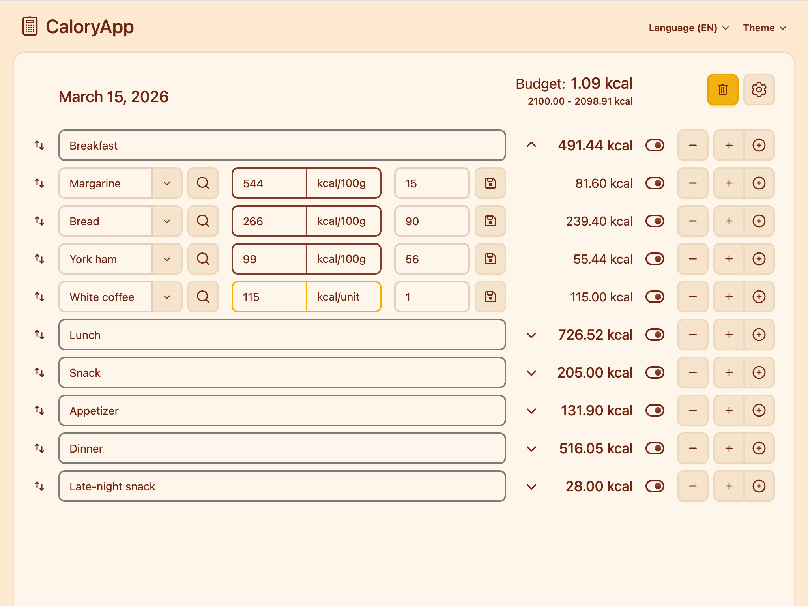

<h1 align="center">CaloryApp</h1>

Add foods. Count calories. That's it!

  
  <!--  -->
  

 

  

## Development

See [DEV.md](./DEV.md) for technical documentation.

## Get Involved

- [Request a feature](https://github.com/caloryapp/caloryapp.github.io/issues/new?template=feature_request.md)
- [Report a bug](https://github.com/caloryapp/caloryapp.github.io/issues/new?template=bug_report.md)
- [Browse open issues](https://github.com/caloryapp/caloryapp.github.io/issues)
